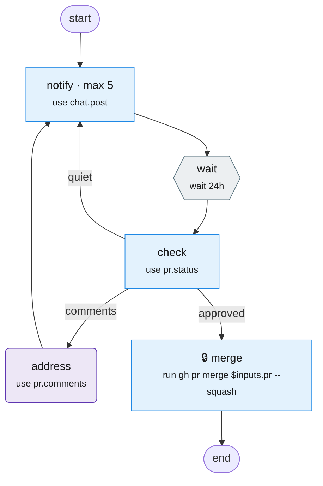

# tablature

Configuration as code for agent flows.

The goal of tablature is **consistent flows across a team or project**. Infrastructure as code made deploys repeatable. Tablature does the same for the automation loops that teams now run with agents: ticket to PR, review follow-up, hotfix to prod.

A `.tab` file describes one loop. It can mix **agentic** steps (a skill, an agent prompt) with **deterministic** steps (a script, a shell command, an MCP call). It sets the order, the human gates, the branches, the retries, the waits, and the parts that run in parallel.

A `.tab` file is **not** a skill. A skill is long: intent, how-to, examples, and output formats. A tab is short. It holds only the **flow and the gates**. The skills, scripts, and MCP tools it calls hold the details. A person can review a tab on one screen, and a team can share it.

## Example

[`examples/pr-follow-up.tab`](examples/pr-follow-up.tab):

```yaml
tab: 0.1
name: pr-follow-up
actions: ./actions.yaml
about: Nudge reviewers daily until the PR is approved, then merge.

inputs:
  pr: {type: int, ask: required}

steps:
  notify:
    use: chat.post
    with: {channel: build, text: "Review please: PR $inputs.pr"}
    max: 5

  wait:
    wait: 24h

  check:
    use: pr.status
    with: {pr: $inputs.pr}
    out: {verdict: [quiet, comments, approved]}
    route: {quiet: notify, comments: address, approved: merge}

  address:
    use: pr.comments
    with: {pr: $inputs.pr}
    interactive: true
    next: notify

  merge:
    gate: confirm
    run: gh pr merge $inputs.pr --squash
```

`use: chat.post` names an action. [`actions.yaml`](examples/actions.yaml) binds each action to a script, a skill, or an MCP tool. Change the binding, and every tab that uses it changes too.

<!-- mermaidify: examples/pr-follow-up.tab -->

<!-- /mermaidify -->

Key: blue = deterministic (script, shell, MCP), purple = agentic (skill, agent prompt), orange = human choice, green = sub-flow, grey = durable wait, 🔒 = needs human approval, `max` = loop limit.

Every example has a diagram: [examples/README.md](examples/README.md).

## Status

Draft. The syntax is still changing.

- [docs/spec.md](docs/spec.md): the format
- [docs/design.md](docs/design.md): principles, prior art, open questions
- [skills/tablature](skills/tablature/SKILL.md): the Claude skill that runs `.tab` files
- [skills/mermaidify](skills/mermaidify/SKILL.md): draws any `.tab` file as a Mermaid flowchart
- [examples/](examples/):
  - `pr-follow-up.tab`: the example above
  - `ticket-flow.tab`: ticket → fix → PR → review follow-up → merge
  - `hotfix.tab`: demo-box sampling and the fix run in parallel, then expedited review and prod deploy
  - `demo-deploy.tab`: fix → sample before and after on the demo box → PR with stats
  - `fix.tab`: shared sub-flow (worktree, red-green, full tests)
  - `actions.yaml`: binds action names to scripts, skills, and MCP tools
  - `scripts/`: action scripts (Google Chat, PR status, recent authors)

## Draw a flow

```sh
bin/mermaidify examples/hotfix.tab            # Mermaid to stdout
bin/mermaidify --fence examples/hotfix.tab    # in a ```mermaid block
bin/mermaidify --update examples/*.mermaid.md # refresh the diagrams in docs
```

`--update` fills each block between `<!-- mermaidify: path.tab -->` and `<!-- /mermaidify -->`. It needs only Ruby (the macOS system Ruby works).

## Install the skills

```sh
ln -s "$PWD/skills/tablature" ~/.claude/skills/tablature
ln -s "$PWD/skills/mermaidify" ~/.claude/skills/mermaidify
```

Then in Claude Code: `/tablature run examples/ticket-flow.tab ticket=PROJ-123`, or `/mermaidify examples/hotfix.tab`.

## License

[Apache License 2.0](LICENSE). Keep the [NOTICE](NOTICE) file in copies and derived works.
