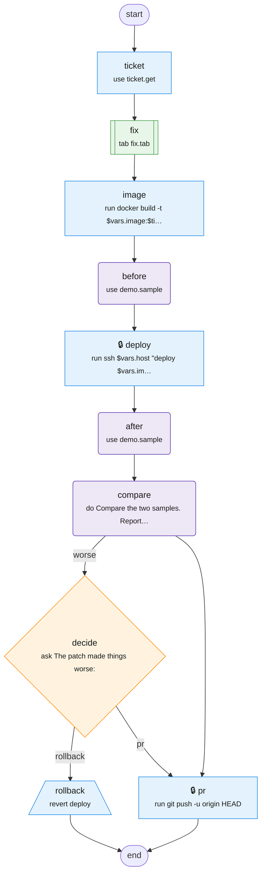

# demo-deploy

Build a ticket fix, measure it on the demo box, and open a PR with the results.

Source: [demo-deploy.tab](demo-deploy.tab). Made with `bin/mermaidify --update`.

<!-- mermaidify: demo-deploy.tab -->

<!-- /mermaidify -->
