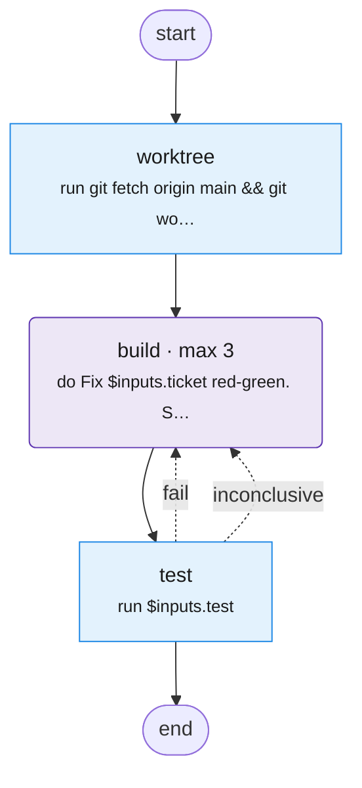

# fix

Make a worktree from main, fix the ticket red-green, and run the full test suite.

Source: [fix.tab](fix.tab). Made with `bin/mermaidify --update`.

<!-- mermaidify: fix.tab -->

<!-- /mermaidify -->
