# hotfix

Ship a prod fix fast. Sample the demo box while the fix is built.

Source: [hotfix.tab](hotfix.tab). Made with `bin/mermaidify --update`.

```mermaid
flowchart TD
  START([start])
  START --> s_ticket
  s_ticket["ticket<br/><small>use ticket.get</small>"]
  s_ticket --> s_claim
  s_claim["claim<br/><small>use ticket.claim</small>"]
  s_claim --> s_start
  subgraph s_start["start · parallel, need all"]
    direction LR
    subgraph s_start__baseline["baseline"]
      direction TB
  s_before("before<br/><small>use demo.sample</small>")
    end
    subgraph s_start__fix["fix"]
      direction TB
  s_build[["build<br/><small>tab fix.tab</small>"]]
  s_build --> s_image
  s_image["image<br/><small>run docker build -t $vars.image:hot…</small>"]
    end
  end
  s_start --> s_demo
  s_demo["🔒 demo<br/><small>run docker save $vars.image:hotfix-…</small>"]
  s_demo --> s_after
  s_after("after<br/><small>use demo.sample</small>")
  s_after --> s_compare
  s_compare("compare<br/><small>do Compare the two samples. Give a…</small>")
  s_compare -- worse --> s_undo_demo
  s_compare --> s_pr
  s_pr["🔒 pr<br/><small>run git push -u origin HEAD</small>"]
  s_pr --> s_review
  subgraph s_review["review · parallel, need all"]
    direction LR
    subgraph s_review__self["self"]
      direction TB
  s_self_review("self-review<br/><small>use pr.review</small>")
    end
    subgraph s_review__people["people"]
      direction TB
  s_reviewers["reviewers<br/><small>use pr.reviewers</small>"]
  s_reviewers --> s_page
  s_page["page<br/><small>use chat.post</small>"]
    end
  end
  s_review --> s_wait
  s_wait{{"wait · max 8<br/><small>wait 1h</small>"}}
  s_wait --> s_check
  s_check["check<br/><small>use pr.status</small>"]
  s_check -- quiet --> s_nudge
  s_check -- comments --> s_address
  s_check -- approved --> s_merge
  s_nudge["nudge<br/><small>use chat.post</small>"]
  s_nudge --> s_wait
  s_address("address<br/><small>use pr.comments</small>")
  s_address -- approved --> s_merge
  s_address -- pending --> s_wait
  s_merge["🔒 merge<br/><small>run gh pr merge $pr.number --squash…</small>"]
  s_merge --> s_prod
  s_prod["🔒 prod<br/><small>run docker save $vars.image:hotfix-…</small>"]
  s_prod --> s_verify
  s_verify["verify<br/><small>run ssh $vars.prod healthcheck</small>"]
  s_verify -. fail .-> s_undo_prod
  s_verify -. inconclusive .-> s_undo_prod
  s_verify --> END_
  s_undo_demo[/"undo-demo<br/><small>revert demo</small>"\]
  s_undo_demo --> FAIL_
  s_undo_prod[/"undo-prod<br/><small>revert prod</small>"\]
  s_undo_prod --> FAIL_
  END_([end])
  FAIL_([fail])
  classDef agent fill:#ede7f6,stroke:#5e35b1,color:#1a1a1a
  classDef det fill:#e3f2fd,stroke:#1e88e5,color:#1a1a1a
  classDef human fill:#fff3e0,stroke:#fb8c00,color:#1a1a1a
  classDef wait fill:#eceff1,stroke:#546e7a,color:#1a1a1a
  classDef sub fill:#e8f5e9,stroke:#43a047,color:#1a1a1a
  class s_ticket,s_claim,s_image,s_demo,s_pr,s_reviewers,s_page,s_check,s_nudge,s_merge,s_prod,s_verify,s_undo_demo,s_undo_prod det
  class s_before,s_after,s_compare,s_self_review,s_address agent
  class s_build sub
  class s_wait wait
```

<!-- mermaidify: hotfix.tab -->

<!-- /mermaidify -->
