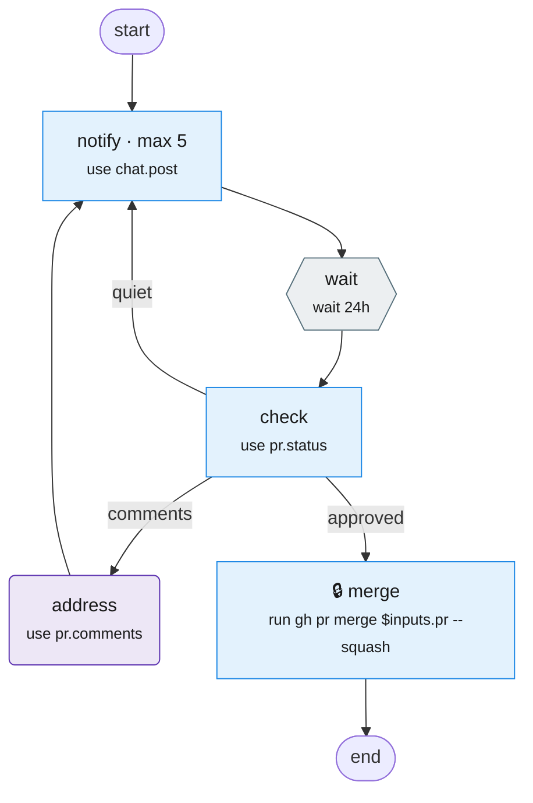

# pr-follow-up

Nudge reviewers daily until the PR is approved, then merge.

Source: [pr-follow-up.tab](pr-follow-up.tab). Made with `bin/mermaidify --update`.

<!-- mermaidify: pr-follow-up.tab -->

<!-- /mermaidify -->
