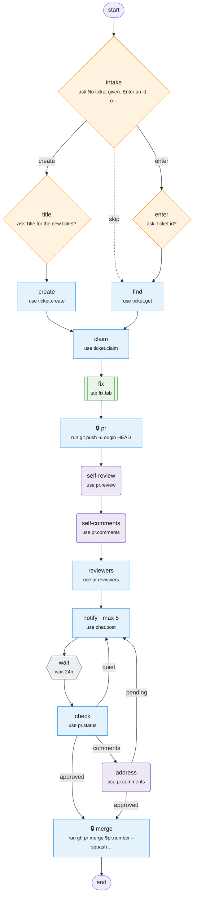

# ticket-flow

Take one ticket from intake to merged PR, with review follow-up.

Source: [ticket-flow.tab](ticket-flow.tab). Made with `bin/mermaidify --update`.

<!-- mermaidify: ticket-flow.tab -->

<!-- /mermaidify -->
